# Self-Attention and Transformer
自注意力机制和Transformer始于文本领域，之后被逐渐运用于语音处理，CV等领域。本篇介绍将知乎讲解、台大李宏毅老师的教程做一汇总，当作一个Tutorial。文中只是对相关内容做进一步解释和补充，若想从零开始学习，则务必依次浏览文中对应链接的文章。

## Self-Attention in Sound and Text
>https://zhuanlan.zhihu.com/p/338817680

上述链接中图解了Transformer在文本领域的应用，其中Transformer的论文图如下。下面我根据下图对上述链接提到的内容进行补充。

 

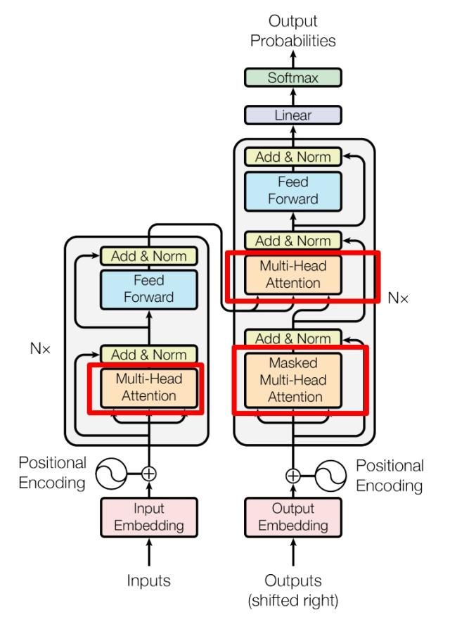 

 

首先，论文中Encoder(左)与Decoder(右)进行交互的部分，即Encoder最后一个MultiHeadAttention模块的输出，与WQ、WK矩阵相乘，得到 Q、K 矩阵后，这两个矩阵和 Outputs经过Mask-MultiHeadAttention模块输出的结果经过与WV相乘得到V矩阵，作为N个 Decoder MultiHeadAttention模块的输入。李宏毅老师讲到，其实不一定Decoder MultiHeadAttention每次都用 Encoder最后一层得到的输出，也可以采用其他多种连接方式：

 

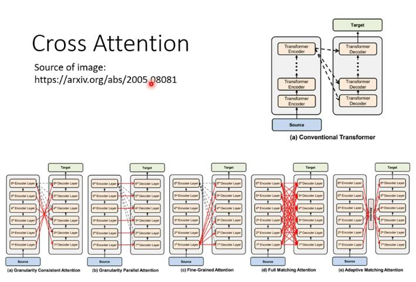 

 

其次，关于 Attention 中 Q,K,V 矩阵的理解。

> https://www.zhihu.com/question/298810062/answer/1828080188 (回答者：
陀飞轮 复旦大学 微电子学院硕士)

这个问题首先要有一个数学的先验知识，两个向量a和b同向，a.b=|a||b|；a和b垂直，a.b=0；a和b反向，a.b=-|a||b|。所以两个向量的点乘可以表示两个向量的相似度，越相似方向越趋于一致，a点乘b数值越大。有了这个先验知识，回到self-attention上

 

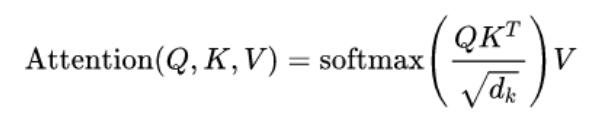 

 

上面是self-attention的公式，Q和K的点乘表示Q和K的相似程度，但是这个相似度不是归一化的，所以需要一个softmax将Q和K的结果进行归一化，那么softmax后的结果就是一个所有数值为0-1的mask矩阵(可以理解为attention score矩阵)，而V表示的是输入线性变换后的特征，那么将mask矩阵乘上V就能得到过滤后的V特征。

**总结一下就是，Q和K的引入是为了得到一个所有数值为0-1的mask矩阵，V的引入是为了保留输入的特征。**

这里如果还是不好理解，可以移步台大李宏毅老师用语音信号向量做 Self-Attention 的例子

>https://www.bilibili.com/video/BV1Xp4y1b7ih?p=1

实际上，上述公式所进行的矩阵操作，实际上是把向量运算并行处理了。单纯看向量的话如下图，这里的$a^1,a^2,a^3,a^4$表示的是 句子中的每个单词/25ms语音 向量化后的结果，含有实际物理意义：

 

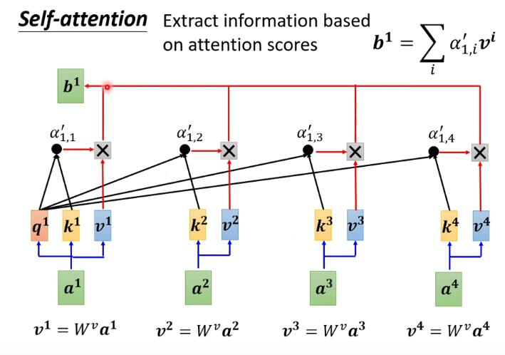 

 

输入四个向量$a^1,a^2,a^3,a^4$，经过Attention后，要求输出$b^1,b^2,b^3,b^4$，以$b^1$为例，它是由$a^1$用得到的$q^1$分别去与$k^1,k^2,k^3,k^4$计算相似度(点乘)作为权重，再将结果分别于$v^1,v^2,v^3,v^4$相乘得到加权后的特征$V=(b^1 b^2 b^3 b^4)$，下面两张图更能体现矩阵运算中暗含的向量计算：

 

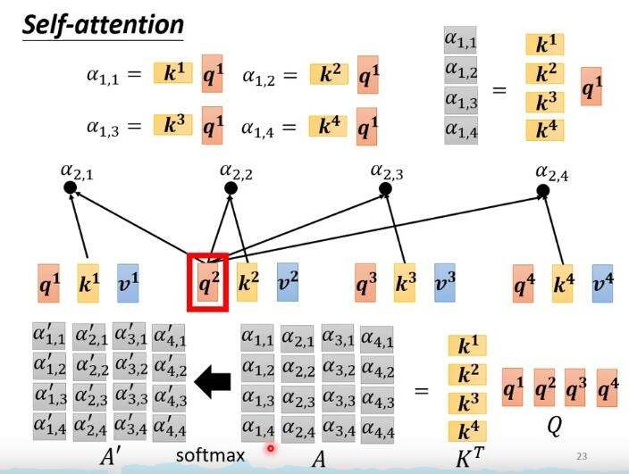 

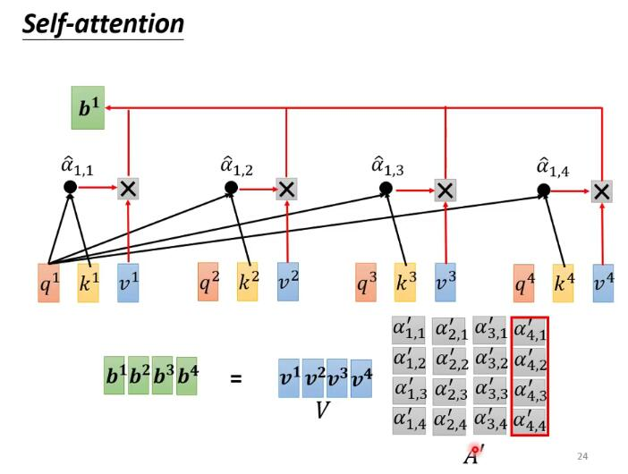 

 
还有一个形象的比喻(来自知乎：安珂 郑州大学生物信息学)：

假如一个男生B，面对许多个潜在交往对象B1，B2，B3...，他想知道自己谁跟自己最匹配，应该把最多的注意力放在哪一个上。那么他需要这么做：

1、他要把自己的实际条件用某种方法表示出来，这就是Value；

2、他要定一个自己期望对象的标准，就是Query；

3、别人也有期望对象标准的，他要给出一个供别人参考的数据，当然不能直接用自己真实的条件，总要包装一下，这就是Key；

4、他用自己的标准去跟每一个人的Key比对一下（Q*K），当然也可以跟自己比对，然后用softmax求出权重，就知道自己的注意力应该放在谁身上了，有可能是自己哦。

最后附上李宏毅老师对Self-Attention模块的图解： 

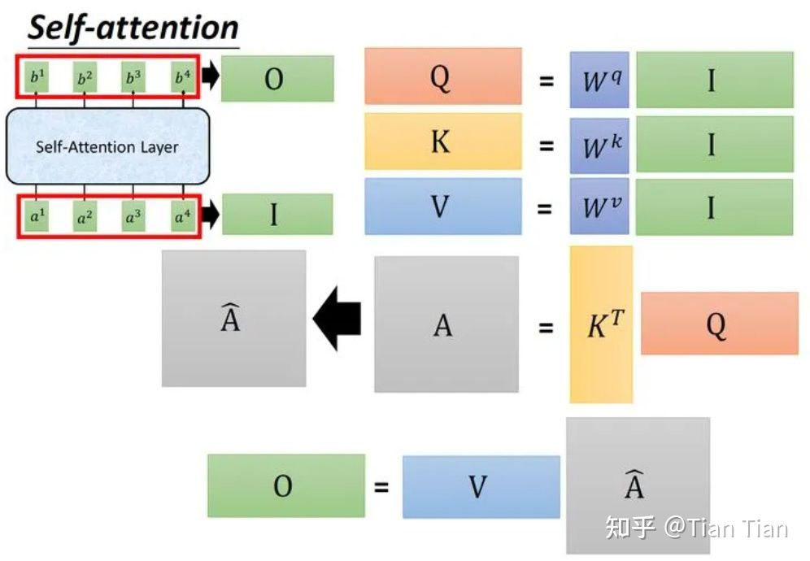 

 

为什么文本和语音信号可以看成一种模态进行处理呢？因为二者经过向量化后(文本一个词/字作为一个向量，语音每25ms模拟信号作为一个向量，每隔10ms取一次)，都是一串向量序列，处理向量序列之前有RNN、LSTM，但这些模型将向量输入模型时，只能按序列依次输入，而Self-Attention模块可以并行处理，且可以同时比较所有上下文信息。**自注意力机制的引入是为了捕捉输入序列各项之间的依赖关系，尤其是捕捉那些在序列模型很容易被丢失掉的长范围依赖关系。**

## CV 中的 Self-Attention 与 Transformer
CV 中将Self-Attention模块引入的典型论文为：《Non-local Neural Networks》，来自卡内基·梅隆大学（CMU）的Xiaolong Wang、FAIR 何凯明等。具体讲解(
铁心核桃 清华大学 工学博士)：

>https://zhuanlan.zhihu.com/p/353442085

 

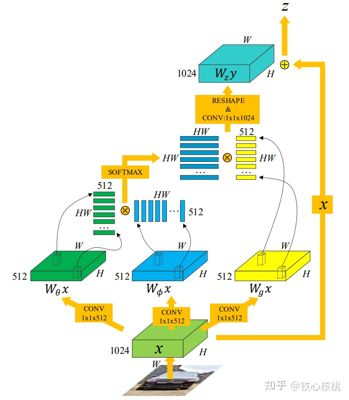 

 

由上图可以看出注意力机制利用在静态图像的机制，几乎与语音/文本向量处理几乎一致$W_\theta x,W_\phi x, W_g x$实际就是$Q,K,V$矩阵，只不过图像的**序列**是从特征图 $x$ 中得到的。

Non-local网络在时空序列数据上的应用

在对视频这样的时空序列进行分类等操作时，Non-local网络的处理方式与针对静态图像空间序列的处理方式类似。只不过在静态图像中，自注意力机制考虑的仅仅是某像素与其他所有位置像素的关系，而在视频序列中，自注意力机制考虑的是某帧上的某像素与所有帧上的所有像素之间的关系。上述链接中讲的也很清晰。

Paper中的图也很好的表示了注意力机制在图像处理中的物理含义，第一帧的球上的像素点与之后的人/足球相关性更强，而不是背景中的草地/树林：

 

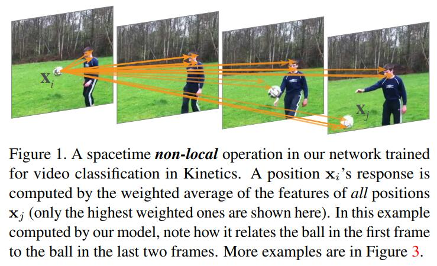 

 

这样对特征图进行一个加权化的处理，使得特征图中的内部信息关联被进一步挖掘，利用 Q,K 得到的权重矩阵，放大 V 中关联性较强的部分，降低关联性较弱的部分。

关联性怎么从矩阵中理解？如下图所示，首先我们考虑在文本处理中，一个单词被映射成一个向量，输入$X$中每一行代表一个单词的信息(1,2,3,4四个单词)，经过线性运算得到$V$,$V$的每一行依旧保留了每一个单词的信息。

 

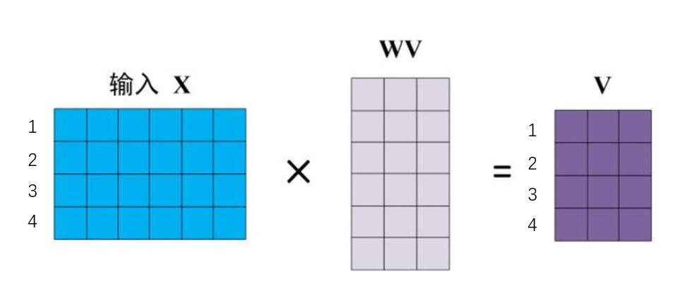 

 

Q矩阵与K矩阵类似，每一行依旧保留了每一个单词的信息，现在计算$QK^T$，可以看到$QK^T$矩阵中含有各个单词之间的关联性信息，:

 

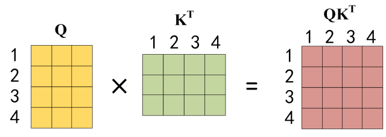 

 

随后$Softmax(QK^T)$，得到权重矩阵，再与$V$相乘，直接看我们很难看出关联性到$Z$的变化:

 

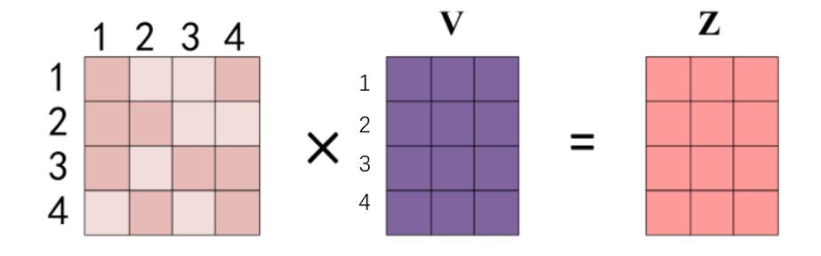 

 

但矩阵计算有个小技巧，我们只看$Z$的第一行$Z_1$，它是由$V$的每一行(暗含每个单词信息)加权而来，而权重刚好是权重矩阵第一行，物理含义即单词1分别于1，2，3，4单词的相关性：

 

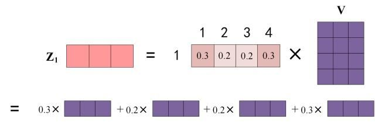 

 

这样我们通过对特征矩阵V的权重变化，引入了全局的关联性。

在CV特征图中虽然没有像QKV每个矩阵的行向量对应的单词物理意义，但是我们可以理解，通过引入注意力模型，可以发掘引入特征图中，每个部分之间的相关性。